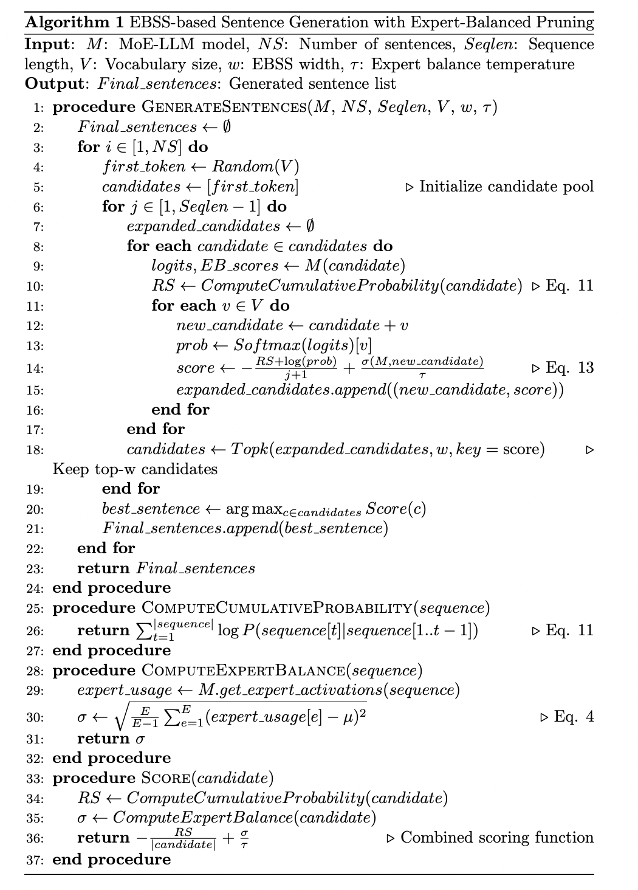
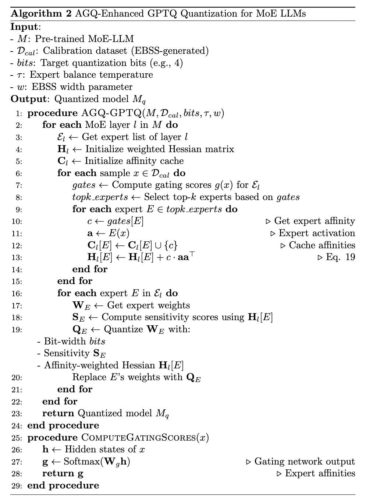

## Supplementary Tables

**Table R1: Impact of Calibration Datasets on Expert Balance and Quantization Performance in MoE LLMs.** The expert balance std denotes the standard deviation on frequency of expert.

| Model | Calib Dataset | Expert Balance STD  | WIKITEXT2 | MMLU | HUMANEVAL | GSM8K | BOOLQ| HELLASWAG | OPENBOOKQA | MATHQA | AVG Accuracy | 
| :--------------: | :---: | :---: | :---: | :---: | :---: | :---: | :---: | :---: | :---: | :---: | :---: |
| DeepSeek-MoE-16B | Float |   \    | 6.51 | 44.60 | 26.83 | 20.16 | 72.72|58.06|32.20|31.49|40.86|
|                  | RTN   |   \    | 7.47 | 36.10 | 18.90 | 10.54 |70.21|55.76|30.60|28.87|35.85|
|                  | wikitext2 | 0.0427 | 6.67 | 40.60 | 22.56 | 19.18 | 72.17|57.03|30.60|30.95|39.01|
|                  | humaneval | 0.0877 | 6.85 | 43.60 | 21.34 | 15.39 | 73.79|56.91|30.80|30.48|38.90|
|                  | gsm8k     | 0.0928 | 6.88 | 42.40 | 21.65 | 16.59 | 73.57|57.01|30.20|30.72|38.88|
|                  | EBSS      | 0.0052 | 6.77 | 44.00 | 23.78 | 18.19 | 73.24|57.21|31.80|30.92|**39.87**|

---

**Table R2:  Impact of Temperature Parameter τ on Average Accuracy Across 7 Tasks for MoE LLMs.**

|        τ         |  1.0  |  1.1  |  1.2  |  1.3  |  1.4  |  1.5  |
| :--------------: | :---: | :---: | :---: | :---: | :---: | :---: |
| DeepSeek-MoE-16B | 39.82 | 39.89 | **40.01** | 39.89 | 39.69 | 39.71 |
|   QwenMoE-14B    | 49.49 | 49.53 | **49.60** | 49.61 | 49.59 | 49.55 |
|   Mixtral-8x7B   | 55.54 | 55.56 | **55.58** | 55.58 | 55.49 | 55.53 |

---

**Table R3: Impact of Searching Width $w$ in EBSS on Quantization Accuracy for MoE LLMs Across 7 Tasks.** 

|       $w$        |   2   |   3   |   4   |   5   |   6   |  10   | 20    |
| :--------------: | :---: | :---: | :---: | :---: | :---: | :---: | ----- |
| DeepSeek-MoE-16B | 39.77 | 39.80 | 40.01 | 39.98 | 40.01 | 40.00 | 40.10 |
|   QwenMoE-14B    | 49.19 | 49.45 | 49.59 | 49.59 | 49.61 | 49.60 | 49.63 |
|   Mixtral-8x7B   | 55.12 | 55.54 | 55.58 | 55.56 | 55.60 | 55.60 | 55.64 |

---

**Table R4：Cosine Similarity Between Approximated and Original GateLayer Outputs in DeepSeek-MoE-16B Under Varying c Values (Equation 17).** Higher c values significantly improve alignment with the original gating behavior, achieving near-perfect similarity (≥0.99) for c≥0.5. 

|    c    |  0.1   |  0.2   |  0.3   |  0.4   |  0.5   |  0.6   |  0.7   |  0.8   |  0.9   |
| :-----: | :----: | :----: | :----: | :----: | :----: | :----: | :----: | :----: | :----: |
| Cos Sim | 0.9090 | 0.9425 | 0.9685 | 0.9874 | 0.9926 | 0.9894 | 0.9949 | 0.9980 | 0.9996 |

---

**Table R5：Impact of Affinity Guided Quantization on Gate-Layer Performance for Three MoE LLMs.** 

|         Model         | AGQ for Gate-Layer | Wiki PPL | AVG Accuracy |
| :-------------------: | :----------------: | :------: | :------: |
|   Qwen-MoE-14B-Chat   |         ×          |   8.74   |  44.41   |
|                       |         √          |   8.65   |  **44.95**   |
| DeepSeek-MoE-16B-Chat |         ×          |   7.77   |  45.87   |
|                       |         √          |   7.70   |  **46.20**   |
|     MIXTRAL-8x7B      |         ×          |   4.12   |  55.24   |
|                       |         √          |   4.12   |  **55.58**   |

---

**Table R6: Time Overhead of EBSS on 3 MoE LLMs.** MoEQuant generates 128 sequences of 512 length, in order to make full use of the computing power to improve efficiency, we stitch multiple sequences together in the batch dimension. All experiments are completed on a single card A800.

| Model            | Time Cost |
| ---------------- | --------- |
| Qwen-MoE-14B     |   18 mins  |
| DeepSeek-MoE-16B |   12 mins  |
| Mixtral-8x7B     |   42 mins  |

---

## Supplementary Algorithms

**Algorithm 1: EBSS-based Sentence Generation with Expert-Balanced Pruning**

---

**Algorithm 2: AGQ-Enhanced GPTQ Quantization for MoE LLMs**

        

